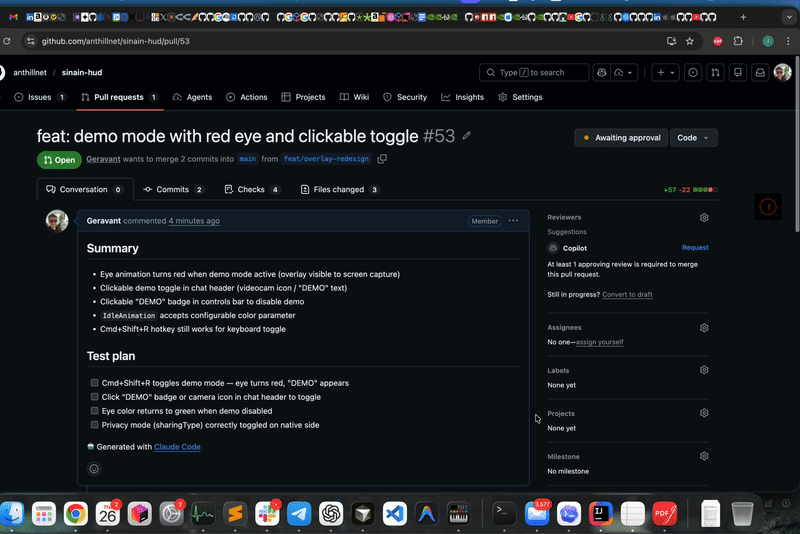

# Sinain 

[](LICENSE)
[](https://github.com/anthillnet/sinain-hud/actions/workflows/ci.yml)
[](https://www.npmjs.com/package/@geravant/sinain)
[](https://support.apple.com/macos)
[](https://www.microsoft.com/windows)

Ambient intelligence that sees what you see, hears what you hear, and acts on your behalf.

<p align="center">
  
</p>

**[Quick Start](#quick-start)** · **[Docs](docs/)** · **[Privacy](docs/privacy-protection-design.md)** · **[Configuration](docs/CONFIGURATION.md)** · **[Contributing](CONTRIBUTING.md)**

---

### You, Augmented

Sinain captures your screen and audio continuously, runs OCR and transcription, and feeds a rolling context window to your agent. The agent analyzes what's happening, surfaces advice on a private HUD overlay, and can act on its own — fixing code, running commands, or spawning background tasks.

- Screen capture → OCR → context digest, updated every few seconds.
- System audio → transcription (local whisper.cpp or cloud) → real-time awareness.
- Private overlay: only you see it. Never in screenshots, recordings, or screen shares.

### Agent-Agnostic

Sinain feeds the same screen and audio context to any MCP-compatible agent. Switch agents on the fly — no restart, no context loss.

- Tested with Claude Code, OpenClaude, Codex, Goose, Junie, and Aider. Any MCP-compatible agent works.
- Pick agents **per lane** in the overlay's flash-icon selector — escalations and spawn tasks can route to different agents simultaneously.
- Add custom profiles (personal Claude config, alternate models, server-side gateways) by editing [`agents.json`](docs/AGENT-ROSTER.md). The roster is the source of truth.
- Knowledge modules travel with you — export from one machine, import on another.

### Privacy Controls

By default, sinain uses cloud APIs (OpenRouter) for transcription and analysis. When you need tighter control, switch privacy modes — no code changes, one env var.

- `off` → `standard` → `strict` → `paranoid` — four modes in `~/.sinain/.env`.
- `paranoid` mode: Ollama + whisper.cpp, fully offline. No network calls.
- HUD overlay is invisible to screen capture (`NSWindow.sharingType = .none`).

## Quick Start

```bash
npx @geravant/sinain@latest start
```

That's it. On first run, sinain will:
1. Run an **interactive setup wizard** — transcription backend, API key, agent, privacy mode
2. **Auto-download** the overlay app, sck-capture binary, and Python dependencies
3. **Start all services** — sinain-core, sense_client, overlay, and agent

> **Pin `@latest`** on every invocation. `npx @geravant/sinain` (without `@latest`) caches *forever* against the unversioned spec — you'd silently keep running an old version for months. Sinain self-updates automatically when stale, but pinning `@latest` makes it explicit and saves a redundant relaunch.

> **Re-run the wizard** anytime: `npx @geravant/sinain@latest start --setup`

### Prerequisites

- **Node.js 18+** — [nodejs.org](https://nodejs.org/) (LTS recommended)
- **Python 3.10+** — `brew install python3` (macOS) or [python.org](https://www.python.org/downloads/)
- **OpenRouter API key** (optional for local-only mode) — [openrouter.ai](https://openrouter.ai)

> **Fully local?** No API key needed. Ollama + whisper-cli = zero cloud. See [Running Fully Local](#running-fully-local).

### macOS Permissions

1. **System Settings → Privacy & Security → Screen Recording** — add your Terminal
2. **System Settings → Privacy & Security → Microphone** — add your Terminal

### Managing sinain

```bash
npx @geravant/sinain@latest stop             # stop all services
npx @geravant/sinain@latest status           # check what's running
npx @geravant/sinain@latest start --setup    # re-run setup wizard
npx @geravant/sinain@latest start --no-sense # skip screen capture
npx @geravant/sinain@latest start --no-overlay  # headless mode
```

> Always pin `@latest` — see the note in [Quick Start](#quick-start) above.

## Architecture

```
┌─── Your Device ─────────────────────────────────────────────────────┐
│                                                                     │
│  sck-capture (Swift)                                                │
│    ├─ system audio (PCM) ──► sinain-core :9500                      │
│    └─ screen frames (JPEG) ──► sense_client ─── POST /sense ──►    │
│                                                      │              │
│                              ┌────────────────────────┘              │
│                              │                                      │
│                         sinain-core                                 │
│                           ├─ audio pipeline → transcription         │
│                           ├─ agent loop → digest + HUD text         │
│                           ├─ escalation ──► OpenClaw Gateway (WS)   │
│                           │                  or sinain-agent (poll)  │
│                           └─ WebSocket feed                         │
│                                  │                                  │
│                                  ▼                                  │
│                           overlay (Flutter)                         │
│                           private, invisible to screen capture      │
│                                                                     │
└─────────────────────────────────────────────────────────────────────┘
                                   │
                          ┌────────┴─────────┐
                          ▼                  ▼
                   OpenClaw Gateway    sinain-agent
                   (server or local)   (bare agent, no gateway)
                     ├─ sinain-hud plugin
                     │   └─ sinain-knowledge (curation, playbook, eval)
                     └─ SITUATION.md, Telegram alerts
```

## Components

| Component | Language | What it does | Docs |
|---|---|---|---|
| **sinain-core** | TypeScript | Central hub: audio pipeline, agent loop, escalation, WS feed | [README](sinain-core/README.md) |
| **overlay** | Dart / Swift / C++ | Private HUD (macOS + Windows), 4 display modes, hotkeys | [Hotkeys](docs/HOTKEYS.md) |
| **sense_client** | Python | Screen capture, SSIM diff, OCR, privacy filter | [sense_client/](sense_client/) |
| **sck-capture** | Swift | ScreenCaptureKit: system audio + screen frames | [tools/sck-capture/](tools/sck-capture/) |
| **sinain-agent** | Bash | Shell harness that connects any agent to sinain-core | [sinain-agent/](sinain-agent/) |
| **sinain-knowledge** | TypeScript | Curation, playbook, eval, portable knowledge modules | [Knowledge System](docs/knowledge-system.md) |
| **sinain-hud-plugin** | TypeScript | OpenClaw plugin: lifecycle, curation, overflow watchdog | [sinain-hud-plugin/](sinain-hud-plugin/) |
| **sinain-mcp-server** | TypeScript | MCP server exposing sinain tools to agents | [sinain-mcp-server/](sinain-mcp-server/) |

## Configuration

Sinain splits config across two files in `~/.sinain/`:

- **`.env`** — secrets (API keys, gateway tokens) and infrastructure (ports, audio device, privacy mode, analyzer LLM).
- **`agents.json`** — agent roster + bare-agent infra + escalation policy (default agent, allowed-tools whitelists, gateway URLs, escalation mode, analyzer pacing).

Both are created by the setup wizard. To re-run: `npx @geravant/sinain start --setup`.

### Agents & profiles → `agents.json`

The agent roster lives in `~/.sinain/agents.json`. Each entry is a profile mapping a name to a binary + behavior type + optional env, settings, and model overrides. The overlay's flash-icon selector lets you pick which profile handles each lane (escalation vs spawn) at runtime. Custom profiles like `pclaude` (personal claude with its own config dir) or `nemoclaw` (server-side gateway) are first-class — the dispatch decision keys off `profile.type`, not the profile name.

See **[Agent Roster & Profiles](docs/AGENT-ROSTER.md)** for the complete schema, recipes, and routing model.

### Context Analysis (HUD summarizer) → `.env`

The context analysis loop runs every 3–30 seconds, sending recent audio/screen context to an LLM. It produces a digest used for escalation scoring — when the score threshold is met (or always in `rich` mode), the digest is forwarded to the escalation agent for a full response.

| Variable | Default | Description |
|---|---|---|
| `ANALYSIS_PROVIDER` | `openrouter` | `openrouter` (cloud) or `ollama` (local, free) |
| `ANALYSIS_MODEL` | `google/gemini-2.5-flash-lite` | Primary model for text analysis |
| `ANALYSIS_VISION_MODEL` | `google/gemini-2.5-flash` | Auto-selected when screen images are present |
| `ANALYSIS_ENDPOINT` | *(auto per provider)* | Override for custom OpenAI-compatible endpoints |
| `ANALYSIS_API_KEY` | *(from OPENROUTER_API_KEY)* | API key; not needed for ollama |
| `ANALYSIS_FALLBACK_MODELS` | `gemini-2.5-flash,...` | Comma-separated fallback chain |

### Other Key Settings → `.env`

| Variable | Default | Description |
|---|---|---|
| `OPENROUTER_API_KEY` | — | Required (unless `ANALYSIS_PROVIDER=ollama` + local transcription) |
| `OPENCLAW_WS_TOKEN`, `OPENCLAW_HTTP_TOKEN` | — | Gateway secrets, referenced from `agents.json` via `${VAR}` indirection |
| `PRIVACY_MODE` | `off` | `off` / `standard` / `strict` / `paranoid` |

See [docs/CONFIGURATION.md](docs/CONFIGURATION.md) for the full reference.

## Privacy Modes

| Mode | What it does |
|---|---|
| `off` | All data flows freely — maximum insight quality |
| `standard` | Auto-redacts credentials before cloud APIs (wizard default) |
| `strict` | Only summaries leave your machine — no raw text sent to cloud |
| `paranoid` | Fully local: Ollama + whisper.cpp. Zero network calls. |

See [Privacy Threat Model](docs/privacy-protection-design.md) for the full design.

## Hotkeys

Global hotkeys use **Cmd+Shift** (macOS) or **Ctrl+Shift** (Windows):

| Shortcut | Action |
|---|---|
| `Cmd+Shift+Space` | Toggle overlay visibility |
| `Cmd+Shift+M` | Cycle display mode |
| `Cmd+Shift+/` | Open command input |
| `Cmd+Shift+H` | Quit overlay |

See [docs/HOTKEYS.md](docs/HOTKEYS.md) for all 15 shortcuts.

## Running Fully Local

No cloud APIs needed. Local models handle everything:

```bash
# 1. Install local transcription
./setup-local-stt.sh

# 2. Install Ollama + vision model
brew install ollama && ollama pull llava

# 3. Start in local mode
./start-local.sh
```

| Model | Size | Speed | Best for |
|---|---|---|---|
| `llava` | 4.7 GB | ~2s/frame | General use (recommended) |
| `llama3.2-vision` | 7.9 GB | ~4s/frame | Best accuracy |
| `moondream` | 1.7 GB | ~1s/frame | Fastest, lower quality |

## Setup Guides

| Setup | Guide |
|---|---|
| **Agent Roster & Profiles** | [docs/AGENT-ROSTER.md](docs/AGENT-ROSTER.md) — pick agents, add custom profiles, route gateways |
| Local OpenClaw | [docs/INSTALL-LOCAL.md](docs/INSTALL-LOCAL.md) |
| Remote OpenClaw | [docs/INSTALL-REMOTE.md](docs/INSTALL-REMOTE.md) |
| NemoClaw (Brev) | [docs/INSTALL.md](docs/INSTALL.md) |
| Bare Agent | [docs/INSTALL-BARE-AGENT.md](docs/INSTALL-BARE-AGENT.md) |
| Windows | [setup-windows.sh](setup-windows.sh) |
| From Source | `git clone`, `cp .env.example ~/.sinain/.env`, `./start.sh` |

## Knowledge System

Sinain builds a persistent knowledge graph from everything it captures — audio transcriptions, screen OCR, and agent interactions. Facts are distilled incrementally (on buffer full and session end), stored in an EAV triplestore with graph relationships, and retrieved via hybrid search (FTS5 + tag-based + entity graph backrefs with RRF fusion).

The integration step is fully deterministic — no LLM decides what to store. Every extracted fact is preserved.

```bash
npx @geravant/sinain export-knowledge   # export playbook, modules, graph
npx @geravant/sinain import-knowledge ~/sinain-knowledge-export.tar.gz
```

See [Knowledge System docs](docs/knowledge-system.md) for architecture details.

## Deep Dives

| Topic | Doc |
|---|---|
| Knowledge System | [docs/knowledge-system.md](docs/knowledge-system.md) |
| Escalation Architecture | [docs/clean-architecture-escalation.md](docs/clean-architecture-escalation.md) |
| Personality Traits | [docs/PERSONALITY-TRAITS-SYSTEM.md](docs/PERSONALITY-TRAITS-SYSTEM.md) |
| Privacy Threat Model | [docs/privacy-protection-design.md](docs/privacy-protection-design.md) |
| HUD Skill Protocol | [docs/HUD-SKILL-PROTOCOL.md](docs/HUD-SKILL-PROTOCOL.md) |
| Full Configuration | [docs/CONFIGURATION.md](docs/CONFIGURATION.md) |
| All Hotkeys | [docs/HOTKEYS.md](docs/HOTKEYS.md) |

## Contributing

See [CONTRIBUTING.md](CONTRIBUTING.md).

## License

MIT
