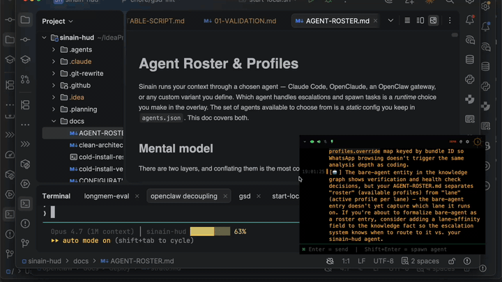

# Sinain 

**Context OS** — ambient intelligence for builders. Captures what you see and hear, distills it into a private knowledge graph, accessible from MCP, a web UI, and a screen-recording-invisible HUD overlay.

  

**[Quick Start](#quick-start)** · **[Docs](docs/)** · **[Privacy](docs/privacy-protection-design.md)** · **[Configuration](docs/CONFIGURATION.md)** · **[Contributing](CONTRIBUTING.md)**

---

### You, Augmented

Sinain captures your screen and audio continuously, distills the stream into a **structured live knowledge graph** of facts, entities, and decisions, and exposes that graph through every interface: MCP, a web UI, and an invisible HUD overlay.

- **Capture** — screen frames + system audio, with `<private>` tag stripping and auto-redaction of credentials and tokens *before* anything leaves your machine.
- **Distill** — facts (atomic claims), entities (people / projects / topics), decisions (what was chosen and why) — extracted by an LLM, integrated by deterministic graph operations (no LLM in the integration step).
- **Access from anywhere** — **MCP server** for agents (Claude Code, Codex, Goose, OpenClaude, Junie), **web UI** at `localhost:9500/knowledge/ui/` for browsing, and a **HUD overlay** for in-the-moment recall.

The HUD overlay is invisible to screen capture — never appears in screenshots, recordings, or screen shares.
